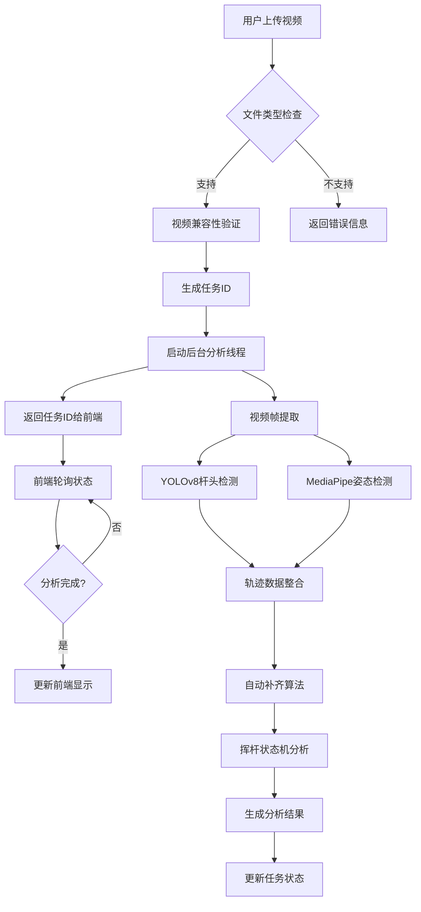
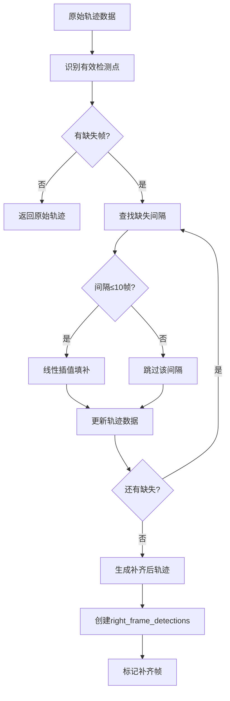
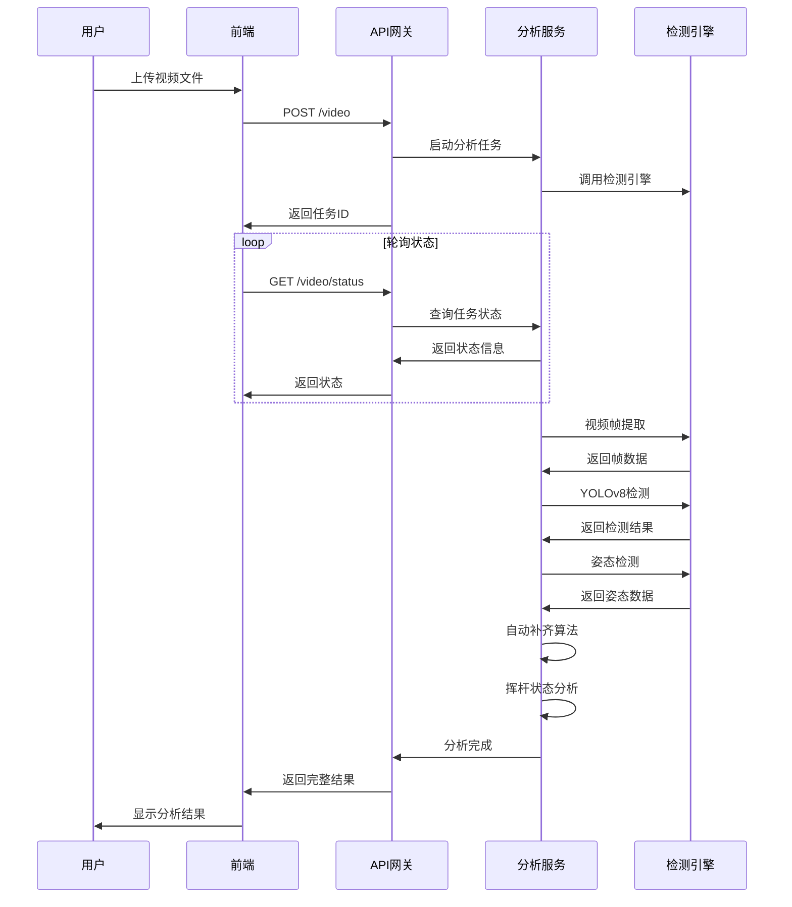
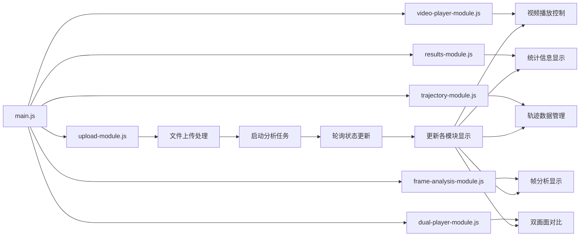
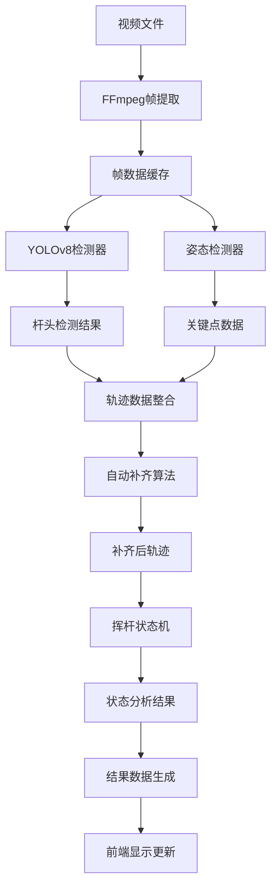
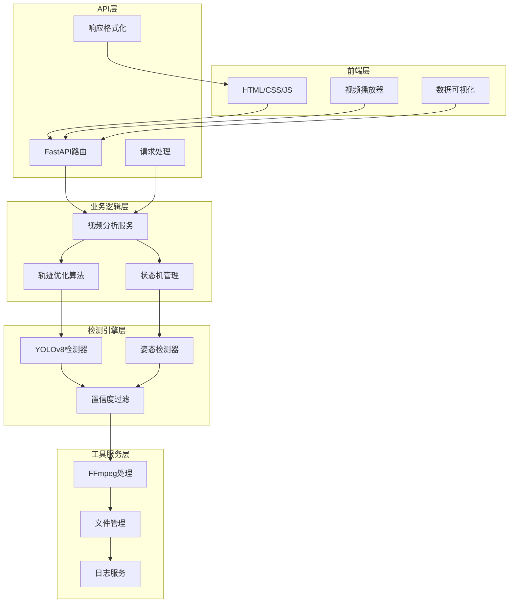
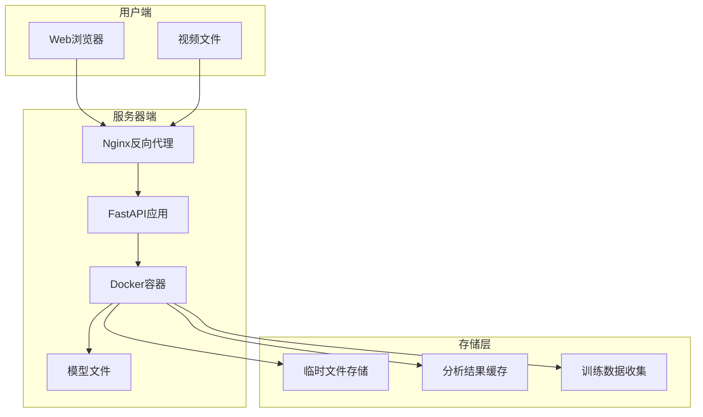

# MyGolfTracker 项目流程图

## 🎯 系统整体流程图

```mermaid
graph TB
    A[用户上传视频] --> B{文件类型检查}
    B -->|支持| C[视频兼容性验证]
    B -->|不支持| D[返回错误信息]
    
    C --> E[生成任务ID]
    E --> F[启动后台分析线程]
    F --> G[返回任务ID给前端]
    
    G --> H[前端轮询状态]
    H --> I{分析完成?}
    I -->|否| H
    I -->|是| J[更新前端显示]
    
    F --> K[视频帧提取]
    K --> L[YOLOv8杆头检测]
    K --> M[MediaPipe姿态检测]
    
    L --> N[轨迹数据整合]
    M --> N
    N --> O[自动补齐算法]
    O --> P[挥杆状态机分析]
    P --> Q[生成分析结果]
    Q --> R[更新任务状态]
```

## 🔄 自动补齐算法流程图

```mermaid
graph TD
    A[原始轨迹数据] --> B[识别有效检测点]
    B --> C{有缺失帧?}
    C -->|否| D[返回原始轨迹]
    C -->|是| E[查找缺失间隔]
    E --> F{间隔≤10帧?}
    F -->|是| G[线性插值填补]
    F -->|否| H[跳过该间隔]
    G --> I[更新轨迹数据]
    H --> I
    I --> J{还有缺失?}
    J -->|是| E
    J -->|否| K[生成补齐后轨迹]
    K --> L[创建right_frame_detections]
    L --> M[标记补齐帧]
```

## 🌐 API接口调用流程图

```mermaid
sequenceDiagram
    participant U as 用户
    participant F as 前端
    participant A as API网关
    participant S as 分析服务
    participant D as 检测引擎
    
    U->>F: 上传视频文件
    F->>A: POST /video
    A->>S: 启动分析任务
    S->>D: 调用检测引擎
    A->>F: 返回任务ID
    
    loop 轮询状态
        F->>A: GET /video/status
        A->>S: 查询任务状态
        S->>A: 返回状态信息
        A->>F: 返回状态
    end
    
    S->>D: 视频帧提取
    D->>S: 返回帧数据
    S->>D: YOLOv8检测
    D->>S: 返回检测结果
    S->>D: 姿态检测
    D->>S: 返回姿态数据
    S->>S: 自动补齐算法
    S->>S: 挥杆状态分析
    S->>A: 分析完成
    A->>F: 返回完整结果
    F->>U: 显示分析结果
```

## 🎨 前端模块交互图

```mermaid
graph LR
    A[main.js] --> B[upload-module.js]
    A --> C[video-player-module.js]
    A --> D[results-module.js]
    A --> E[trajectory-module.js]
    A --> F[frame-analysis-module.js]
    A --> G[dual-player-module.js]
    
    B --> H[文件上传处理]
    C --> I[视频播放控制]
    D --> J[统计信息显示]
    E --> K[轨迹数据管理]
    F --> L[帧分析显示]
    G --> M[双画面对比]
    
    H --> N[启动分析任务]
    N --> O[轮询状态更新]
    O --> P[更新各模块显示]
    P --> I
    P --> J
    P --> K
    P --> L
    P --> M
```

## 🔧 数据处理管道图

```mermaid
graph TD
    A[视频文件] --> B[FFmpeg帧提取]
    B --> C[帧数据缓存]
    
    C --> D[YOLOv8检测器]
    C --> E[姿态检测器]
    
    D --> F[杆头检测结果]
    E --> G[关键点数据]
    
    F --> H[轨迹数据整合]
    G --> H
    
    H --> I[自动补齐算法]
    I --> J[补齐后轨迹]
    
    J --> K[挥杆状态机]
    K --> L[状态分析结果]
    
    L --> M[结果数据生成]
    M --> N[前端显示更新]
```

## 📊 数据流架构图

```mermaid
graph TB
    subgraph "前端层"
        A[HTML/CSS/JS]
        B[视频播放器]
        C[数据可视化]
    end
    
    subgraph "API层"
        D[FastAPI路由]
        E[请求处理]
        F[响应格式化]
    end
    
    subgraph "业务逻辑层"
        G[视频分析服务]
        H[轨迹优化算法]
        I[状态机管理]
    end
    
    subgraph "检测引擎层"
        J[YOLOv8检测器]
        K[姿态检测器]
        L[置信度过滤]
    end
    
    subgraph "工具服务层"
        M[FFmpeg处理]
        N[文件管理]
        O[日志服务]
    end
    
    A --> D
    B --> D
    C --> D
    D --> G
    E --> G
    F --> A
    G --> H
    G --> I
    H --> J
    I --> K
    J --> L
    K --> L
    L --> M
    M --> N
    N --> O
```

## 🚀 部署架构图

```mermaid
graph TB
    subgraph "用户端"
        A[Web浏览器]
        B[视频文件]
    end
    
    subgraph "服务器端"
        C[Nginx反向代理]
        D[FastAPI应用]
        E[Docker容器]
        F[模型文件]
    end
    
    subgraph "存储层"
        G[临时文件存储]
        H[分析结果缓存]
        I[训练数据收集]
    end
    
    A --> C
    B --> C
    C --> D
    D --> E
    E --> F
    E --> G
    E --> H
    E --> I
```

---

*这些流程图展示了MyGolfTracker项目的完整架构和数据流程，包括所有关键组件和它们之间的交互关系。*

